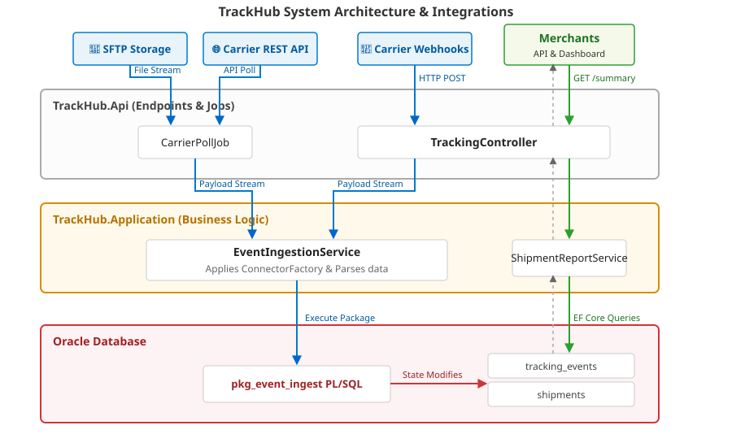

# TrackHub

Cross-carrier package tracking platform. TrackHub ingests tracking events
from multiple carrier feeds, normalises them into a per-shipment timeline,
and exposes a query API to merchant tenants.

## Domain

- A **merchant** is a tenant — an e-commerce store whose shipments we track.
- A **carrier** is a delivery provider (UPSX, FDXP, USPSX, DHL, ...).
- A **shipment** is a single package, uniquely identified per carrier by a
  tracking number.
- A **tracking event** is one update on a shipment — a status code
  (`IN_TRANSIT`, `DELIVERED`, `EXCEPTION`) and an optional location code,
  with a timestamp from the carrier.
- An **event batch** is one delivery of events from a carrier (an SFTP
  file, a webhook POST, a polled REST response).

The platform handles ~50 carriers and ~5,000 merchants. Volume per carrier
varies by ~100x.

## Layout

```
src/
  TrackHub.Domain/         Entities (POCOs)
  TrackHub.Application/    Connectors, services, background jobs
  TrackHub.Infrastructure/ DbContext, EF Core mappings
  TrackHub.Api/            Controllers, Program.cs
sql/
  schema.sql               Oracle DDL
  pkg_event_ingest.pkb     PL/SQL package
  reports.sql              Reporting query used by the dashboard
sample-data/
  upsx-events-2026-05-18.csv   Example UPSX daily file
  fdxp-webhook-sample.json     Example FDXP webhook payload
tests/
  EventIngestionServiceTests.cs
```

## Main flow

`EventIngestionService.IngestAsync` is the entry point. It receives a stream
from either the carrier webhook (`TrackingController.Webhook`) or the SFTP
poller (`CarrierPollJob`), dispatches to the appropriate `ICarrierConnector`
for parsing, and calls `pkg_event_ingest.record_event` once per parsed
event. The procedure upserts into `tracking_events` and rolls the latest
state onto `shipments`.

`ShipmentReportService.GetSummaryForMerchant` is the read path; it backs
the merchant dashboard.

## Building

```
dotnet build TrackHub.sln
```

Targets .NET 8. The application needs an Oracle instance to run end to end
(see `src/TrackHub.Api/appsettings.json`); the test project uses
EF Core's in-memory provider and runs on its own.


